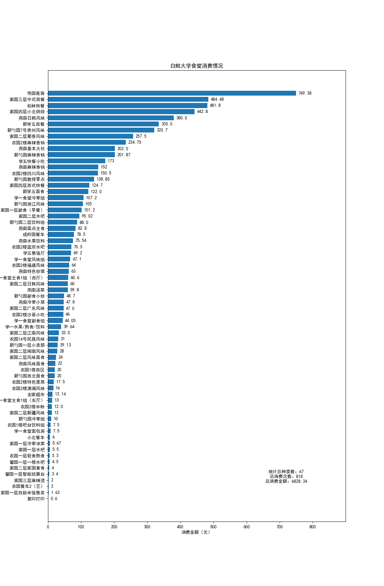
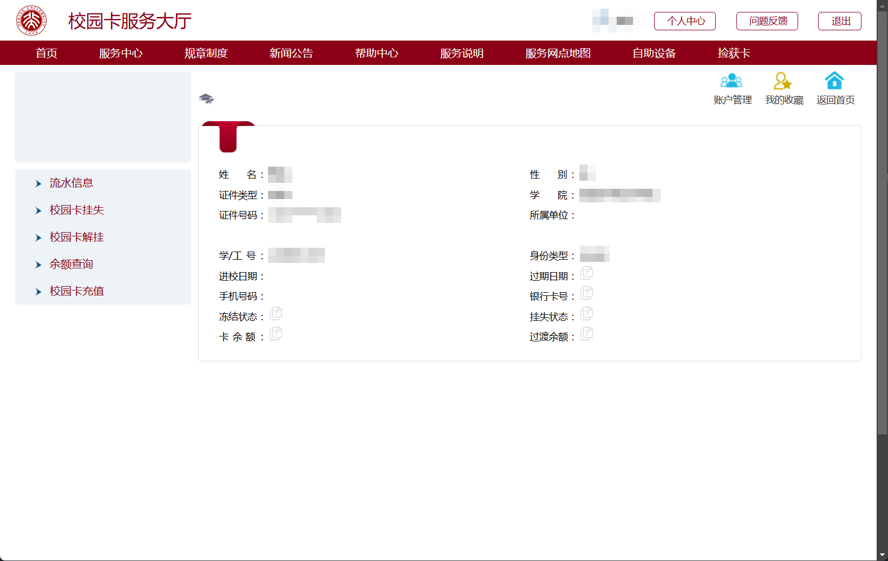
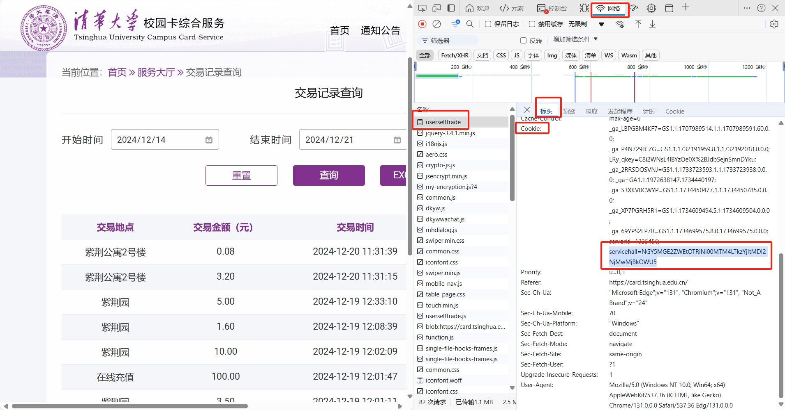

# THU-Annual-Eat

一年过去了，你在华子食堂里花的钱都花在哪儿了？

## 项目简介

本项目是一个用于统计华清大学学生在食堂（和宿舍）的消费情况的脚本。通过模拟登录华清大学校园卡网站，获取学生在华子食堂的消费记录，并通过数据可视化的方式展示。



## 使用方法

### 0. 获取服务代码

首先，登录校园卡账号后，在[华清大学校园卡网站](https://card.tsinghua.edu.cn/userselftrade)获取你的服务代码。



`F12` 打开开发者工具，切换到 Network（网络）标签页，然后 `Ctrl + R` 刷新页面，找到 `userselftrade` 这个请求，查看标头中的 `Cookie` 字段，其中包含了你的服务代码。

服务代码是 `servicehall=` **之后**的一串字符（不含 `servicehall=`），复制下来，后面会用到。



### 1. 安装依赖

本项目依赖于 `requests`、`matplotlib` 和 `pycryptodome`，请确保你的 Python 环境中已经安装了这些库。

```bash
pip install requests matplotlib pycryptodome
```

> 你可能需要在 `Python\Python312\Lib\site-packages` 目录下将 `crypto` 文件夹改名为 `Crypto`。

### 2. 运行脚本

```bash
python main.py
```

首次运行时，请输入你的学号和“服务代码”，会自动保存在 `config.json` 文件中。

### 3.（可选）修改配置

如果你想修改学号或者服务代码，可以直接修改 `config.json` 文件。

```json
{
    "idserial": "你的学号",
    "servicehall": "你的服务代码"
}
```

## LICENSE

除非另有说明，本仓库的内容采用 [CC BY-NC-SA 4.0](https://creativecommons.org/licenses/by-nc-sa/4.0/) 许可协议。在遵守许可协议的前提下，您可以自由地分享、修改本文档的内容，但不得用于商业目的。

如果您认为文档的部分内容侵犯了您的合法权益，请联系项目维护者，我们会尽快删除相关内容。
